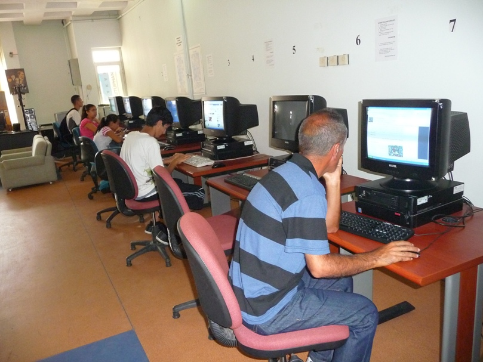
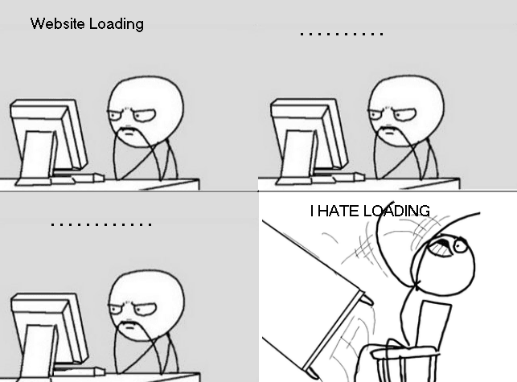

---

title: Gatsby.JS Zero-to-Hero - Introduction
tags: ["javascript", "gatsby"]

---

It's been while i wanted to start my own blog + portfolio. But it's well known 
proverb says __the shoemaker's son always goes barefoot.__ i always delayed. 
Till Today. I'm writing this post inside of my unfinished website.

I'm self tought software-developer whom start **coding / developing / hacking** through retro php cms 
frameworks. i was 12 years old and only internet access i had was from **Library.** The Tech i don't remember at all even 
i don't remember how it's called. 🙃 (it might be joomla, or stoneage version of drupal nor wordpress) 

 

Fast forwarding to the feature. still most of the internet made of the CMS frameworks(Wordpress, Drupal, Squeare Space.. etc)
If you ask what is their commons is that they all relaying a server to serve content. since it's widely used it's almost first target for **Black Hat Hackers.** 

Other then that they are just slow

yeah there will other fellow developers will jump in this conversation and say that. if you do it correctly it will be fast.
etc. etc. but it's just to much work and expenses for get fast website. While theres a better way of doing.  

## Introducing Gatsby.js React Based static site generator.
> Gatsby.js is a static PWA (Progressive Web App) generator. You get code and data splitting out-of-the-box. Gatsby loads only the critical HTML, CSS, data, and JavaScript so your site loads as fast as possible. Once loaded, Gatsby prefetches resources for other pages so clicking around the site feels incredibly fast.

I want to make it short this part because there's already bunch of resources you could read how cool gatsby is. 

Let's get started.

### The Goals of this project is 
Building Static Website usign gatbsy.js from stracth. i will build everything from zero to hero. while writing blog post and 
keep updating status with screenshots. I hope it's gonna make cool tutorial.

#### [Let's Start](next)

