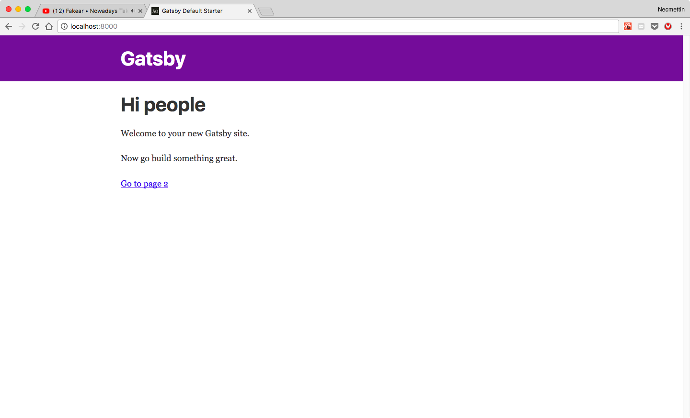
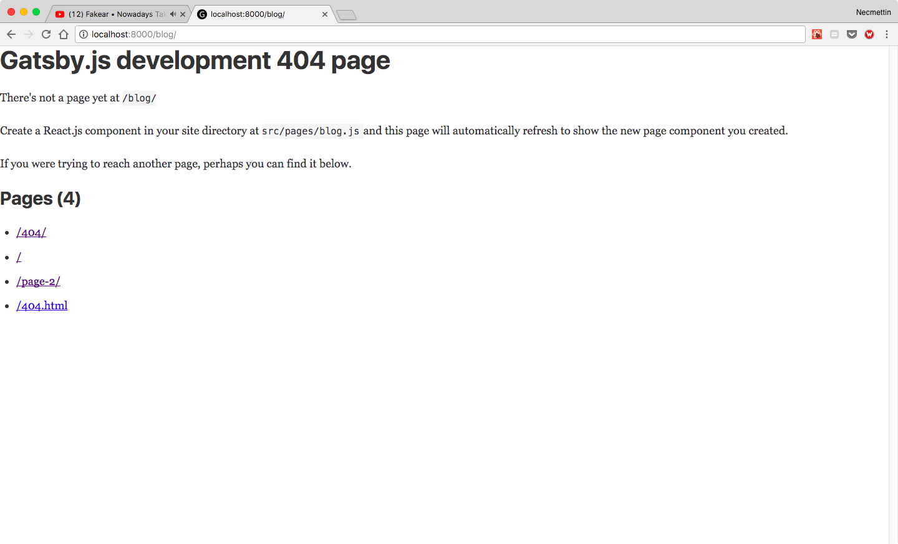
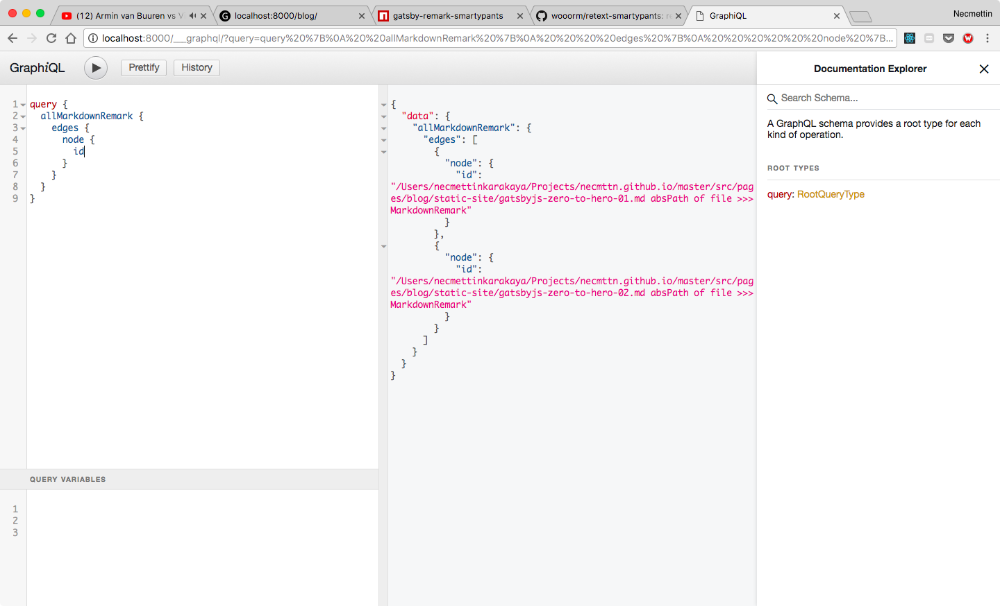

As i said earlier we gonna build this website from strach which mean we will not use any premade starters nor css frameworks.
in order to keep everything schedule and stady i like to keep **Schedule / TO DO** list which allow me to see,
what needs to be done. I like to keeping it most simple and stupid way in `md` file 🤓 .

<script src="https://gist.github.com/9e846f5e3ce369ff4a54f42e8d1be64c.js"></script>


## Starting empty project.

in order to start gatsby project you need to install Gatsby CLI. 

You can install via: 

`npm install --global gatsby-cli`

Once it's done  when you done that. when you type following into your terminal you should have same or higher version printed out there.

```sh
$ gatsby -V
// 1.1.6
```

then go head `cd` to your project folder
```
cd path/to/your/projects/folder
```
and create your project. 

```
gatsby new gatsby-site
```
once it's done.  It will create holder like this. plus to that i create 2 more folder inside of `src` folder. 
`components` and `data` folder. to keep things clean and stady.

```
├── LICENSE
├── README.md
├── gatsby-config.js
├── package-lock.json
├── package.json
├── src
│   ├── components  
│   ├── data
│   ├── layouts
│   ├── pages
│   └── templates
└── yarn.lock
```
after installing the depencies you can run the project 
```
yarn develop
```
then it will start local server for development at port `8000` and graphql server `___graphql` in the same port.  
```
  Your site is running at http://localhost:8000
  Your graphql debugger is running at http://localhost:8000/___graphql
```

Yeah it's loook neat. and total empty but we will change it get ready.

i try to open blog page but it's empty because we don't have plugin for creating converting markdown files to page. one of 
coolest feature of gatsby is it has bunch of plugin. whatever you need therese high change that it's already drop-in ready 
as plugin.
let's start adding plugins for give a shape this article. 

first we gonna add 
```
yarn add gatsby-source-filesystem
```
it's Plugin for creating File nodes from the file system. The various "transformer" plugins transform `File` nodes into various other types of data e.g. `gatsby-transformer-json` transforms `JSON` files into `JSON` data nodes and `gatsby-transformer-remark` transforms markdown files into `MarkdownRemark` nodes from which you can query an HTML representation of the markdown. 

after adding npm package. you also need to add it to `gatsby-config.js` as following.

gatsby-config.js
```
 {
    resolve: `gatsby-source-filesystem`,
    options: {
      name: `pages`,
      path: `${__dirname}/src/pages/`,
    },
  },
  {
    resolve: `gatsby-source-filesystem`,
    options: {
      name: `data`,
      path: `${__dirname}/src/data/`,
    },
  },
```
after adding our new plugin. restart `gatsby dev server` now if we go to our graqhiql we are able to see all our files. 


as i said earlier we will we will need a converter for markdown files. that's where `gatsby-transformer-remark` get in to business. and couple more plugin for images.  

as usual 
```
yarn add gatsby-transformer-remark gatsby-remark-responsive-image gatsby-remark-responsive-iframe gatsby-remark-prismjs gatsby-remark-copy-linked-files gatsby-remark-smartypants
```


and to our gatsby-config.js
```
    {
      resolve: 'gatsby-transformer-remark',
      options: {
        plugins: [
          {
            resolve: 'gatsby-remark-responsive-image',
            options: {
              maxWidth: 590,
            },
          },
          {
            resolve: 'gatsby-remark-responsive-iframe',
            options: {
              wrapperStyle: 'margin-bottom: 1.0725rem',
            },
          },
          'gatsby-remark-prismjs',
          'gatsby-remark-copy-linked-files',
          'gatsby-remark-smartypants',
        ],
      },
    },
```

and now if we go to our graphql we can see our blog pages there 

```
query {
  allMarkdownRemark {
    edges {
      node {
        html
      }
    }
  }
}
``` 
when we query it like this.


now it's time to render our blog post.

let's create one component for list our blog posts

<script src="https://gist.github.com/3e8e4dbf7900c4fccf9ba579aae92a44.js"></script>


